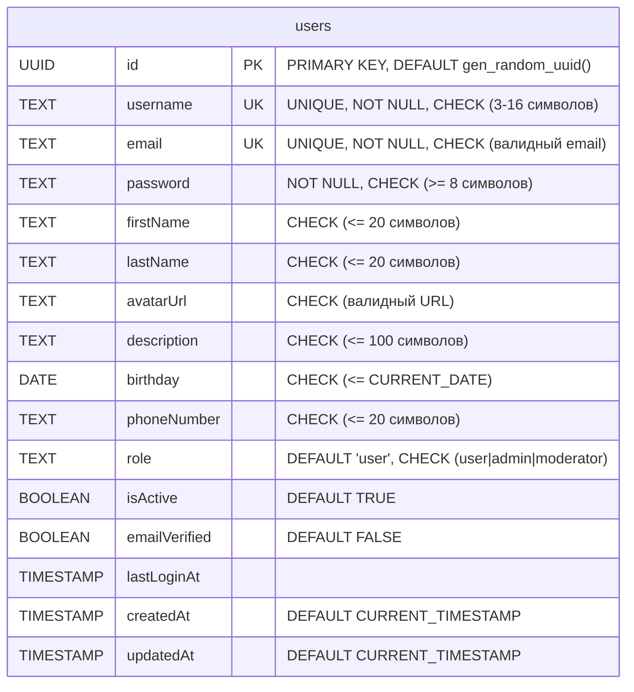

# **Fullkek - Полнофункциональное Fullstack-приложение**

Fullstack приложение, построенное на Node.js с использованием Express и React + TypeScript. Приложение предоставляет REST API для управления пользователями с базой данных PostgreSQL.

## **Структура проекта**

```
fullkek/
├── backend/          # Backend на Node.js + Express + TypeScript
├── frontend/         # Frontend на React + TypeScript + Vite
└── infra/            # Docker Compose конфигурация и SQL скрипты
```

## **Технологический стек**

### Backend
- **Node.js** 16+
- **Express** 5.x
- **TypeScript**
- **PostgreSQL** 16
- **pg** (PostgreSQL клиент)

### Frontend
- **React**
- **TypeScript**
- **Vite**
- **Axios**

### Инфраструктура
- **Docker** & **Docker Compose**
- **PostgreSQL** 16
- **Nginx** (reverse proxy для frontend и backend API)

## **ERD-схема базы данных**



### Описание сущности Users

**Уникальные поля:**
- `id` - UUID идентификатор пользователя
- `email` - адрес электронной почты (уникальный)
- `username` - имя пользователя (уникальное, 3-16 символов)

**Read-only поля:**
- `emailVerified` - подтверждён ли email
- `createdAt` - дата и время создания
- `role` - роль пользователя (user, admin, moderator)
- `isActive` - статус активности
- `lastLoginAt` - дата и время последней авторизации

**Mutable поля:**
- `password` - хэш пароля (минимум 8 символов)
- `firstName` - имя (до 20 символов)
- `lastName` - фамилия (до 20 символов)
- `avatarUrl` - ссылка на аватар (валидный URL)
- `description` - описание (до 100 символов)
- `birthday` - день рождения
- `phoneNumber` - номер телефона (до 20 символов)

## **Переменные окружения**

### Переменные окружения

Файл `infra/.env` используется Docker Compose. Укажите значения:

```env
DB_HOST=db
DB_PORT=5432
DB_NAME=fullkek_db
DB_USER=fullkek_user
DB_PASSWORD=fullkek_password
```

**Важно:** `DB_HOST=db` указывает на имя сервиса в Docker сети.

## **Установка и запуск**

### Предварительные требования

- Docker и Docker Compose

### Запуск проекта

#### 1. Настройка переменных окружения

Проверьте, что в `infra/.env` указаны нужные значения переменных (см. раздел "Переменные окружения").

#### 2. Запуск сервисов

```bash
cd infra
docker-compose up -d
```

Сервисы будут доступны:
- **Frontend** (через Nginx): `http://localhost:80`
- **Backend API** (через Nginx): `http://localhost:80/api/`
- **Backend** (напрямую): `http://localhost:3000`
- **PostgreSQL**: `localhost:5432`

#### 3. Hot-reload и разработка

Проект настроен для разработки с hot-reload:
- **Backend**: изменения в файлах `backend/` автоматически перезагружают сервер
- **Frontend**: изменения в файлах `frontend/` автоматически обновляют страницу в браузере
- Код монтируется через volumes, поэтому изменения применяются мгновенно

**Примечание:** Docker Compose автоматически использует переменные из `infra/.env` для настройки всех сервисов. Переменные передаются в контейнеры через секцию `environment:` в `docker-compose.yml`.

## **API Эндпоинты**

Базовый URL (через Nginx): `http://localhost:80/api/`

### Health Check

**GET /api/health**

Проверка работоспособности сервера

```json
{
  "status": "OK"
}
```

### Users API

Полная документация API доступна в `backend/docs/users-api.md`

#### Получение списка пользователей

**GET /api/users?page={n}&limit={l}**

Параметры:
- `page` - номер страницы (положительное целое число от 1)
- `limit` - количество пользователей на страницу (от 1 до 100)

Пример: `GET /api/users?page=1&limit=20`

#### Получение пользователя по ID

**GET /api/users/{id}**

Пример: `GET /api/users/550e8400-e29b-41d4-a716-446655440000`

#### Создание пользователя

**POST /api/users**

Обязательные поля: `email`, `username`, `password`

#### Обновление пользователя

**PUT /api/users/{id}**

#### Удаление пользователя

**DELETE /api/users/{id}**

## **Разработка**

Все команды разработки выполняются внутри Docker контейнеров.

### Линтинг

Для проверки качества кода в backend:

```bash
docker exec backend npm run lint
```

### Тестирование

```bash
docker exec backend npm test
```

### Просмотр логов

Для просмотра логов всех сервисов:

```bash
cd infra
docker-compose logs -f
```

Для просмотра логов конкретного сервиса:

```bash
cd infra
docker-compose logs -f backend
docker-compose logs -f frontend
docker-compose logs -f nginx
```

## **Changelog**

**v1.0.0**
- Базовая настройка Express
- Health check эндпоинт
- CRUD операции для пользователей
- Интеграция с PostgreSQL
- Docker Compose конфигурация
- React frontend с TypeScript
- Nginx reverse proxy для frontend и backend API
