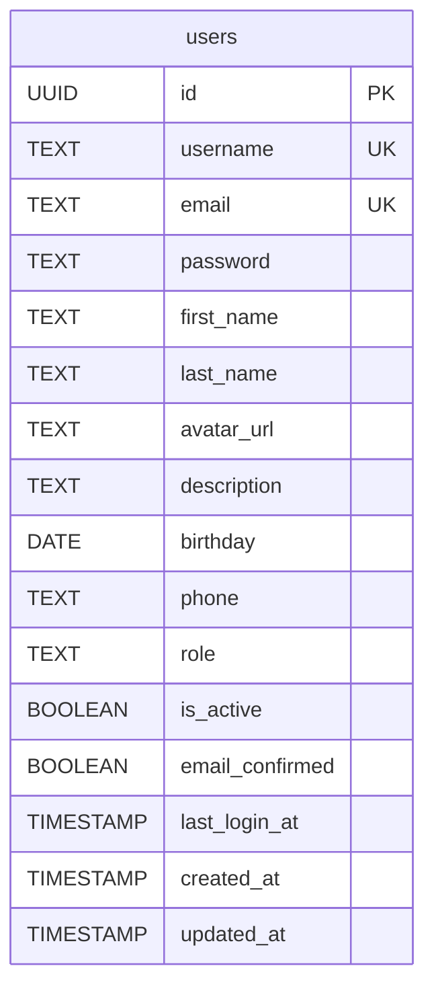

## **ERD-схема базы данных**

```mermaid
erDiagram
    users {
        UUID id PK
        TEXT username UK
        TEXT email UK
        TEXT password
        TEXT first_name
        TEXT last_name
        TEXT avatar_url
        TEXT description
        DATE birthday
        TEXT phone
        TEXT role
        BOOLEAN is_active
        BOOLEAN email_confirmed
        TIMESTAMP last_login_at
        TIMESTAMP created_at
        TIMESTAMP updated_at
    }
```
